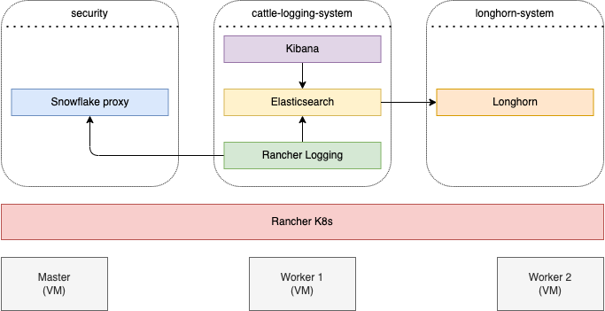

# Support Open Internet for everyone with a Tor proxy

What is Open Internet? For me Open Internet is that all people on the world have access to all (legal) content and services which are provided over the Internet. 

The governments in many countries are filtering content and blocking services for their people. So how could we help those people to get access to services and content outside their country? I asked this question myself and found the https://www.torproject.org/ project. I heard a lot about Tor in the past. But never tried it. So let's give it a try.

This article is about how to install a Tor proxy service on K8s and provide a free, anonymous and instant access to the Internet. Besides that I want to see how many (anonymous) connections and how much traffic is generated over my Tor proxy. For that I'm capturing the logs of my Tor proxy, store them in Elasticsearch and visualize it with Kibana.

I like architecture drawings. So let's start with a picture to give an overview of system.
Architecture

I have created a Rancher K8s cluster on three computer (VMs). One master and two worker nodes. On the K8s cluster I created three namespaces

* security - containing the Snowflake proxy
* cattle-logging-system - containing all logging and analysis tools
* longhorn-system - storage system to provide volumes for Elasticsearch

I will not explain in this article how to setup a K8s cluster and not how to install Rancher Longhorn. Only focusing on the Tor and log analysis.
